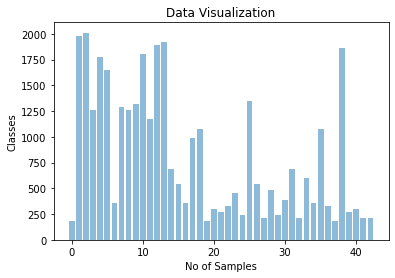
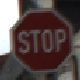

# Traffic Sign Recognition

---

## Building a Traffic Sign Recognition Project

The purpose of this project is to develop a model for traffic sign recognition. The project involves the following steps:
* Loading the [data set](http://benchmark.ini.rub.de/?section=gtsrb&subsection=dataset)
* Exploring, summarizing, and visualizing the data set
* Designing, training, and testing a model architecture
* Using the model to make predictions on new images
* Analyzing the softmax probabilities of the new images
* Summarizing the results in a written report

## Rubric Points
### In this section, I will address each of the [rubric points](https://review.udacity.com/#!/rubrics/481/view) individually and describe how I have implemented them in my project.

---

## Let's Get Started

Here is a link to my [project code](https://github.com/PraveenKumar-Rajendran/CarND-Traffic-Sign-Classifier-Project/blob/main/Traffic_Sign_Classifier.ipynb).

### Data Set Summary & Exploration

#### Basic summary of the data set

To calculate the summary statistics of the traffic sign data set, I used the numpy library in Python. Here are the details:
* The size of the training set is `34,799`
* The size of the validation set is `4,410`
* The size of the test set is `12,630`
* The shape of a traffic sign image is `(32, 32, 3)`
* The number of unique classes/labels in the data set is `43`

#### Exploratory visualization of the dataset

To visualize the data set, I created a bar chart that shows the distribution of classes in the entire data set. This provides an overview of how the data is distributed among the different traffic sign categories.

### Design and Test a Model Architecture

#### Pre-processing the Data Set

As a preprocessing step, I normalized the images using the `cv2.normalize` method from the OpenCV library. Additionally, I converted the normalized RGB images to grayscale before using them for training. The preprocessed image size is `(32, 32, 1)`.

#### Final Model Architecture

The final model architecture consists of the following layers:

| Layer         	| Description	        					| Output Shape     | 
|:-----------------:|:---------------------------------------------:|:----------------:| 
| Input         	| 32x32x1 Grayscale image   					|                  |
| Convolution 5x5   | 2x2 stride, same padding, 32 filters         | 28x28x32         |
| Tanh activation 	|                                              |                  |
| Average pooling	| 2x2 stride, valid padding, outputs 14x14x32  |                  |
| Convolution 5x5   | 1x1 stride, valid padding, 64 filters         | 10x10x64         |
| Tanh activation 	|                                              |                  |
| Average pooling	| 2x2 stride, valid padding, outputs 5x5x64    |                  |
| Flatten layer 	| Output shape 1600 1D                          |                  |
| Dense layer1    	| Output shape 400 1D                           |                  |
| Tanh activation 	|                                              |                  |
| Dense layer2    	| Output shape 120 1D                           |                  |
| Tanh activation 	|                                              |                  |
| Dense layer3    	| Output shape 84 1D                            |                  |
| Tanh activation 	|                                              |                  |
| Dense layer4    	| Output shape 43 1D                            |                  |
| Softmax	        |                                              |                  |
 
Total parameters: 85,631
Trainable parameters: 85,631
Non-trainable parameters: 0

#### Training the Model

To train the model, I used the Adam optimizer with the categorical cross-entropy loss function. The model was trained for 20 epochs. I included a TensorBoard callback for visualizing the model architecture and training progress. The validation set was used to monitor the training progress.

#### Model Performance

The model achieved a training set accuracy of `99.59%` and a validation set accuracy of `93.11%`. The test set accuracy is `92.44%`.

### Testing the Model on New Images

#### Predictions on New Images

I used five German traffic sign images found on the web to test the model's predictions. Here are the images:

   
 

#### Results Summary

The model correctly predicted all five traffic signs, resulting in an accuracy of 100%. This performance compares favorably to the accuracy on the test set, which is 92.44%.

#### Top 5 Probabilities

For each of the new images, I analyzed the top 5 softmax probabilities predicted by the model. The model displayed high confidence in its predictions. Here are the results for the first image:

| Probability    | Prediction                |
|:--------------:|:-------------------------:|
| 0.99999321     | General caution           |
| 0.00000630     | Traffic signals           |
| 0.00000033     | Pedestrians               |
| 0.00000005     | Wild animals crossing     |
| 0.00000004     | Right-of-way at the next intersection |

#### Room for Improvement

Here are some suggestions for further improvement:
- Increase the size of the training data set to improve the model's ability to generalize to different traffic sign datasets from various countries.
- Include a validation set with a different distribution to better evaluate the model's performance on unseen data.
- Address any potential overfitting issues by using a lighter model architecture or applying regularization techniques.

